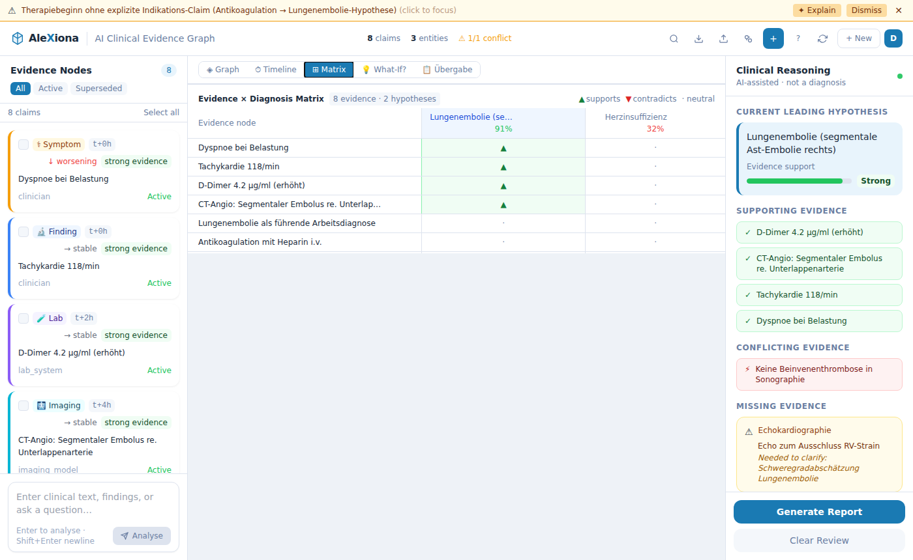
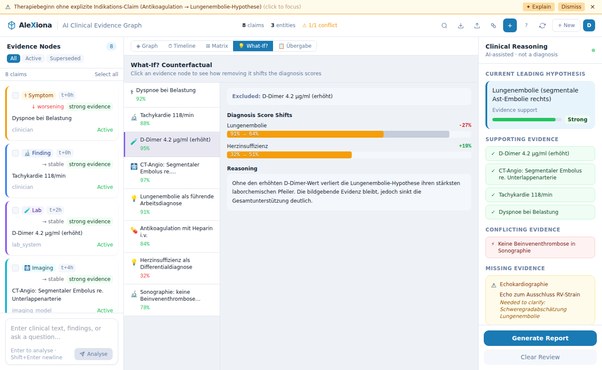
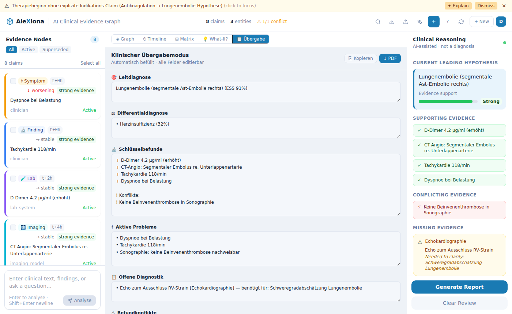
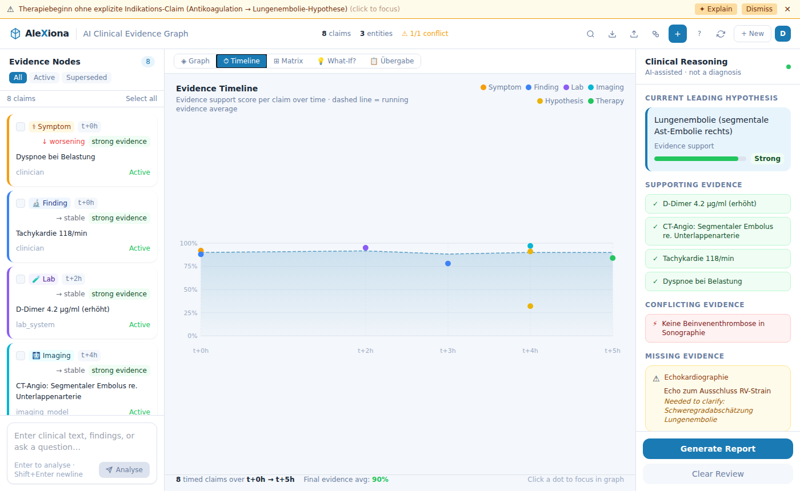

# AleXiona — Clinical Evidence Graph

A clinical reasoning infrastructure demonstrator.
AleXiona turns unstructured clinical input into a versioned, revisable knowledge
structure — an **evidence graph** where every claim carries provenance, supports or
contradicts a hypothesis, and can be challenged by counterfactual analysis.

> **Not a diagnostic system.** AleXiona is a reasoning *aid*. All conclusions require
> verification by a qualified clinician.

---

## Screenshots

| Evidence Graph | Clinical Reasoning |
|---|---|
|  |  |

| Evidence × Diagnosis Matrix | What-If? Counterfactual |
|---|---|
|  |  |

| Clinical Handover (Übergabe) | Evidence Timeline |
|---|---|
|  |  |

---

## What it Does

Instead of storing clinical observations as flat text, AleXiona builds an explicit
**epistemic graph**: each piece of evidence is a typed, timestamped node that either
supports or contradicts a leading hypothesis. Conflicts between claims are detected by
a deterministic rule engine (not an LLM) and surfaced immediately. The graph can be
interrogated — "what changes if this finding were absent?" — via counterfactual
analysis, and exported as a structured handover document.

### Core Capabilities

| Capability | Description |
|---|---|
| **Claim extraction** | LLM converts free text into typed, scored evidence nodes |
| **Evidence graph** | Cytoscape.js force graph with provenance edges (`derives_from`, `possible_related`) |
| **Conflict engine** | Rule-based detection: contradictory values, stale hypotheses, therapy without indication, temporal inconsistencies |
| **Timeline** | Chronological view of all claims by time offset (`t+0h`, `t+6h`, …) |
| **Counterfactual** | "What if this evidence were absent?" — per-node LLM analysis with hypothesis score shifts |
| **Evidence-Impact Matrix** | Claim × hypothesis table annotating which evidence supports or contradicts each hypothesis |
| **Clinical handover** | Auto-populated, editable handover form (Leitdiagnose, Differentialdiagnose, Schlüsselbefunde, Offene Diagnostik, …) with PDF and clipboard export |
| **Conflict explanation** | On-demand LLM explanation for each detected conflict |

---

## Architecture

```
Clinician / Import
       │
       ▼
  Next.js 15 UI
  ├── Evidence Graph (Cytoscape.js)
  ├── Timeline Panel
  ├── Evidence-Impact Matrix
  ├── Counterfactual Panel
  └── Clinical Handover (PDF export)
       │ HTTP / SSE
       ▼
  FastAPI Backend
  ├── LLM Client (OpenAI GPT-4o, structured JSON)
  │     ├── Claim extraction
  │     ├── Clinical reasoning summary
  │     ├── Counterfactual analysis
  │     └── Conflict explanation
  ├── Conflict Engine (rule-based, deterministic)
  │     ├── contradictory_values
  │     ├── therapy_without_indication
  │     ├── stale_hypothesis
  │     └── temporal_inconsistency
  └── Neo4j 5
        ├── (:Claim) nodes — typed, timestamped, versioned
        ├── [:DERIVES_FROM] — explicit epistemic provenance (user-confirmed)
        └── [:POSSIBLE_RELATED] — heuristic similarity (not derivation)
```

---

## Graph Schema

```
(:Claim {
  id, text, session_id,
  claim_type,              // symptom | finding | lab | imaging | hypothesis |
                           // diagnosis | therapy | risk_factor | guideline
  source_type,             // clinician | llm | guideline | imaging_model |
                           //   lab_system | imported_document
  evidence_support_score,  // 0.0–1.0 internal support metric (NOT probability)
  status,                  // active | resolved | superseded
  time_offset,             // "t+0h", "t+6h", etc.
  trend,                   // improving | worsening | stable | unknown
  derived_from             // JSON list of source claim IDs (explicit only)
})

(:Entity { name })

(:Claim)-[:MENTIONS]->(:Entity)
(:Entity)-[:RELATION {type}]->(:Entity)
(:Claim)-[:DERIVES_FROM]->(:Claim)      // explicit epistemic derivation only
(:Claim)-[:POSSIBLE_RELATED]->(:Claim) // heuristic keyword overlap — NOT derivation
```

### Evidence Support Score

`evidence_support_score` is an **internal support metric** (0.0–1.0).
It is displayed as `low / moderate / strong` in the UI.
It is **not a diagnostic probability** and must not be interpreted as such.

### Derivation vs. Similarity

`DERIVES_FROM` is set only by explicit user action ("Add Evidence Node" dialog).
It means: *this claim is a direct logical/clinical consequence of the source*.

`POSSIBLE_RELATED` is a heuristic edge created automatically when two claims share
≥ 2 key medical terms. It indicates topical proximity, **not epistemic derivation**,
and appears as a dotted grey edge in the graph.

---

## Conflict Engine

The conflict engine runs deterministically on the current claim set — no LLM involved.

| Rule | Trigger |
|---|---|
| `contradictory_values` | Two active lab/finding claims reference the same entity with opposing values |
| `therapy_without_indication` | A therapy claim is active but no supporting symptom/finding/diagnosis is present |
| `stale_hypothesis` | A hypothesis is still active but its primary supporting claims have been superseded |
| `temporal_inconsistency` | A derived claim precedes its source in time (`time_offset` violation) |

Conflicts are tiered: `error` → `warning` → `info`. Each can be explained on demand
via the LLM.

---

## Quick Start

### Prerequisites
- Docker + Docker Compose
- OpenAI API key

### Run

```bash
cp .env.example .env
# Add your OPENAI_API_KEY to .env

docker compose up
```

- Frontend: http://localhost:3000
- Backend API: http://localhost:8000/docs
- Neo4j Browser: http://localhost:7474 (neo4j / alexiona123)

### Local Dev

**Backend:**
```bash
cd backend
pip install -r requirements.txt
NEO4J_URI=bolt://localhost:7687 OPENAI_API_KEY=sk-... uvicorn main:app --reload
```

**Frontend:**
```bash
cd frontend
npm install
npm run dev
```

---

## Stack

| Layer | Technology |
|---|---|
| Frontend | Next.js 15, React 19, Cytoscape.js, Tailwind CSS |
| Backend | Python 3.11, FastAPI, Pydantic v2 |
| LLM | OpenAI GPT-4o (structured JSON output) |
| Graph DB | Neo4j 5 (Docker) |
| PDF export | jsPDF |

---

## Design Principles

- **Epistemic claims, not assertions** — every node represents a supported claim, not a fact
- **Conflicts are first-class** — the system highlights what is in tension, not just what is known
- **LLM for language, rules for logic** — conflict detection is deterministic; the LLM handles
  extraction, explanation, and natural language — not the reasoning structure itself
- **Provenance over recency** — `derived_from` is explicit and user-confirmed, never
  auto-inferred from topical similarity
- **Support categories over percentages** — scores are surfaced as `low / moderate / strong`,
  not as probabilities that could be misread as diagnostic confidence
