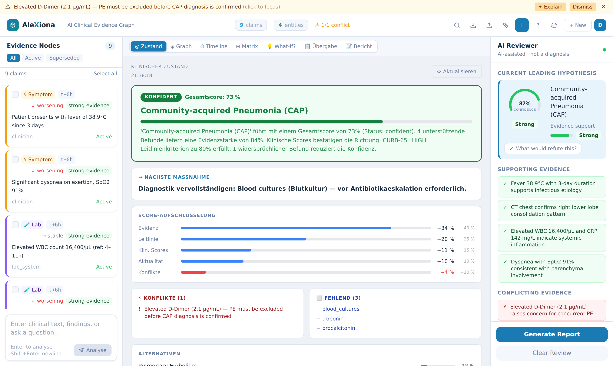
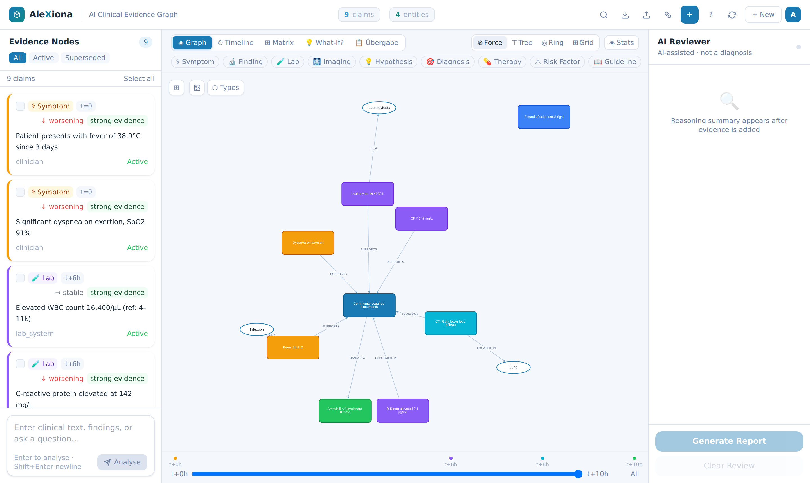
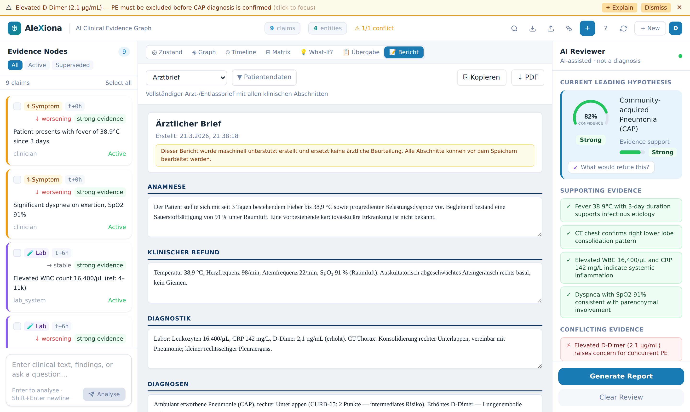
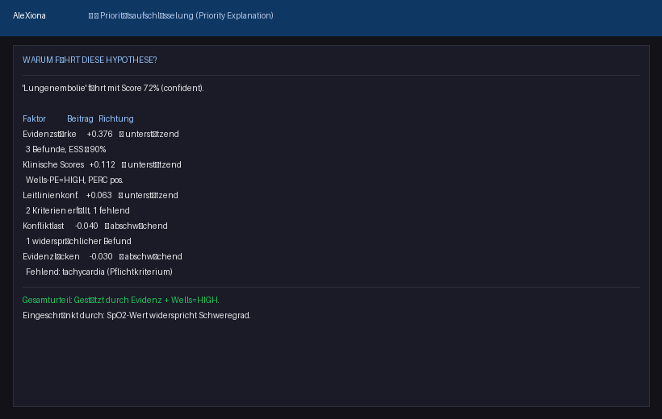
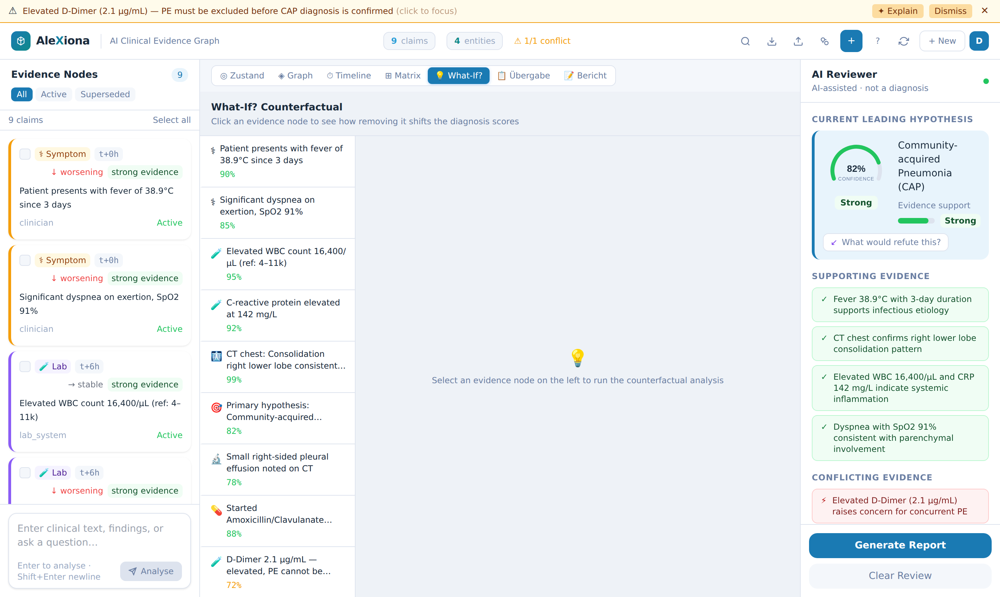

# AleXiona — Clinical Evidence Graph

> **⚠️ Dieses Repository wird nicht weiterentwickelt (29. Juli 2026)** — im Zuge des
> DESi-Abschlusses. **Der klinische Evidenzgraph und seine deterministischen Scores war in keiner der vier Messungen Gegenstand: nicht widerlegt,
> sondern ungeprüft.** Widerlegt wurde DESis Anspruch, aus solchen Strukturen ein epistemisches
> Urteil zu gewinnen. Details: [`PROJEKTABSCHLUSS.md`](PROJEKTABSCHLUSS.md).
>
> **⚠️ This repository is no longer developed (29 July 2026)**, as part of the DESi closure.
> **The clinical evidence graph and its deterministic scores was not the subject of any of the four measurements: not refuted, but untested.**
> What was refuted is DESi's claim to derive an epistemic judgement from such structures. Details:
> [`PROJEKTABSCHLUSS.md`](PROJEKTABSCHLUSS.md).


A clinical reasoning infrastructure demonstrator.
AleXiona turns unstructured clinical input into a versioned, revisable knowledge
structure — an **evidence graph** where every claim carries provenance, supports or
contradicts a hypothesis, and can be challenged by counterfactual analysis.

Collaborators welcome.
Looking for contributors interested in epistemic reasoning, graph systems and explainable AI.

> **Not a diagnostic system.** AleXiona is a reasoning *aid*. All conclusions require
> verification by a qualified clinician.

---

## Screenshots

| ◎ Klinischer Zustand (Orchestrator) | ◈ Evidence Graph |
|---|---|
|  |  |

| 📝 Arztbrief-Generator | Clinical Reasoning Panel |
|---|---|
|  |  |

| ⊞ Evidence × Diagnosis Matrix | 💡 What-If? Evidence Counterfactual |
|---|---|
|  |  |

| Prioritätsaufschlüsselung (Why leading?) | 📋 Clinical Handover (Übergabe) |
|---|---|
|  |  |

| Hypothesis Counterfactual | ⏱ Evidence Timeline |
|---|---|
|  |  |

---

## What it Does

AleXiona builds an explicit **epistemic graph** from clinical input: each piece of
evidence is a typed, timestamped node that either supports or contradicts a leading
hypothesis. A **Clinical Orchestrator** merges five sub-engine signals (evidence score,
guideline compliance, composite risk scores, temporal decay, conflict load) into a
single authoritative state — one leading hypothesis, one verdict, one next action.
Conflicts are detected deterministically and surfaced immediately. The graph can be
interrogated via counterfactual analysis and exported as a structured Arztbrief or
handover document.

### Core Capabilities

| Capability | Description |
|---|---|
| **Clinical Orchestrator** | Single authoritative state: merges evidence (40%), guideline (25%), composite scores (15%), temporal freshness (10%), conflict load (−10%) into one `confident / undecided / contested / insufficient` verdict with a German why-text and concrete next action |
| **SPL pipeline** | All LLM-extracted claims pass through the Semantic Projection Layer: E0 violations blocked, E3 ambiguous claims flagged, E4 dual-interpretation splits handled — no raw-text shortcut |
| **Claim extraction** | LLM converts free text into typed, scored evidence nodes via 5-stage pipeline (LLM → normalise → Pydantic → SPL → persist) |
| **Evidence graph** | Cytoscape.js force graph with provenance edges (`derives_from`, `possible_related`) |
| **Rule-based hypothesis scoring** | Weighted by source type (guideline ×2.0, lab_system ×1.5, llm ×0.5), temporal decay, and conflict severity; composite score boost bounded at +8 pp |
| **Claim contribution analysis** | Per-claim breakdown of exactly *how much* each evidence node drives each hypothesis — direction, magnitude, source_weight, temporal_weight, SPL emission rule, trend_boosted flag |
| **Conflict engine** | 8-rule deterministic detection: contradictory values, stale hypotheses, therapy without indication, temporal inconsistencies, and more |
| **Guideline layer** | Required-evidence criteria for 5 diagnoses (pneumonia, PE, sepsis, MI, heart failure) |
| **Validated risk scores** | 6 bedside scores computed from the claim graph: qSOFA, Wells-PE, GRACE-ACS, HEART, PERC, CURB-65 — each with criteria_met, criteria_missing, and recommendation |
| **Priority explanation** | Transparent decomposition of why the leading hypothesis ranks first: 5 weighted factors with German verdict sentence |
| **Role-based views** | Nurse / resident / specialist / lab / chief each receive exactly the information relevant to their task |
| **Timeline** | Chronological view of all claims by time offset (`t+0h`, `t+6h`, …) |
| **Evidence counterfactual** | "What if this evidence were absent?" — per-node LLM analysis with hypothesis score shifts |
| **Hypothesis counterfactual** | "What would refute this hypothesis?" — shows required changes, decisive evidence, and which hypothesis would become leading |
| **Evidence-Impact Matrix** | Claim × hypothesis table annotating which evidence supports or contradicts each hypothesis |
| **MED engine** | Minimal Evidence to Decision — simulates which test result would most change the current ranking |
| **Clinical Arztbrief** | LLM-generated formal physician letter (Arztbrief, Entlassbrief, Konsiliarbrief, Befundbericht) from the evidence graph — editable, PDF export with letterhead |
| **Clinical handover** | Auto-populated, editable handover form (Leitdiagnose, Differentialdiagnose, Schlüsselbefunde, Offene Diagnostik) with PDF and clipboard export |
| **Conflict explanation** | On-demand LLM explanation for each detected conflict |

---

## Role-Based Clinical Views

`GET /api/graph/{session_id}/view/{role}`

| Role | German alias | What they see |
|---|---|---|
| `nurse` | `pfleger`, `pflegerin` | Vitals with HIGH/LOW flags, trend alerts, active symptoms, monitoring tasks |
| `resident` | `assistenzarzt`, `assistenzärztin` | Full hypothesis ranking, guideline compliance, relevant risk scores, evidence by type, critical alerts |
| `specialist` | `facharzt`, `fachärztin` | Specialty-filtered hypotheses, per-claim contribution breakdown, specialty-matched risk scores (`?specialty=cardiology\|pulmonology\|…`) |
| `lab` | `labor`, `laborant` | Parsed lab values with qualitative flags, abnormal section, pending tests from guideline gaps |
| `chief` | `chefarzt`, `chefärztin`, `oberarzt`, `attending` | Executive summary, differential top-5, risk flags, open issues, case statistics |

---

## Validated Risk Scores

`GET /api/graph/{session_id}/risk-scores`

| Score | Guideline | Interpretation |
|---|---|---|
| **qSOFA** | Singer et al., JAMA 2016 | ≥2 → high sepsis risk |
| **Wells-PE** | Wells et al., 2000 | >6 high / 2–6 intermediate / <2 low PE probability |
| **GRACE-ACS** | Fox et al., BMJ 2006 | ≥5 high / ≥3 intermediate ACS risk |
| **HEART** | Backus et al., 2010 | ≥7 high / 4–6 intermediate / ≤3 low MACE risk |
| **PERC** | Kline et al., 2004 | All 8 absent → PE excluded without D-Dimer |
| **CURB-65** | Lim et al., Thorax 2003 | ≥3 high / 2 intermediate / ≤1 low pneumonia severity |

Composite scores contribute a **bounded boost** (max +8 pp) to the hypothesis score —
they support but cannot dominate the evidence-based ranking.

---

## Clinical Orchestrator

`GET /api/graph/{session_id}/orchestrate`

The single authoritative clinical state. No LLM call — fully deterministic.

```
FINAL_SCORE = evidence_score × 40 %
            + guideline_score × 25 %
            + composite_norm  × 15 %
            + temporal_factor × 10 %
            - conflict_load   × 10 %
```

| Status | Condition |
|---|---|
| `confident` | score ≥ 0.52, ≥ 2 supporting claims, < 3 conflicts |
| `contested` | ≥ 3 conflicts regardless of score |
| `insufficient` | score < 0.25 OR < 2 supporting claims OR no hypotheses |
| `undecided` | everything else |

Returns: `leading_hypothesis`, `orchestrated_score`, `status`, `why` (German verdict),
`key_conflicts` (top 3), `missing_critical` (top 3), `next_action` (one concrete step),
`score_breakdown` (per-factor), `alternatives` (runner-up hypotheses).

---

## Claim Contribution Analysis

`GET /api/graph/{session_id}/reasoning/explain`

Per-claim transparency for every active hypothesis — the SHAP equivalent for rule-based clinical reasoning:

```json
{
  "hypothesis_text": "pulmonary embolism suspected",
  "rule_based_score": 0.855,
  "contributions": [
    {
      "claim_text": "D-Dimer 3.2 µg/mL elevated",
      "direction": "supporting",
      "contribution": 0.855,
      "spl_emission_rule": "E1",
      "source_weight": 1.5,
      "temporal_weight": 1.0,
      "trend_boosted": false
    }
  ],
  "guideline": {
    "required_present": ["dyspnea"],
    "required_missing": ["tachycardia"]
  }
}
```

---

## Architecture

```
Clinician / Import
       │
       ▼
  Next.js 14 UI
  ├── ◎ Clinical Orchestrator Panel  ← default view: ONE unified state
  ├── ◈ Evidence Graph (Cytoscape.js)
  ├── ⏱ Timeline Panel
  ├── ⊞ Evidence-Impact Matrix
  ├── 💡 Evidence Counterfactual Panel
  ├── 💡 Hypothesis Counterfactual Panel
  ├── 📋 Clinical Handover (PDF export)
  └── 📝 Arztbrief / Report Generator (PDF export)
       │ HTTP / SSE
       ▼
  FastAPI Backend
  ├── Clinical Orchestrator  ← the Dirigent (deterministic, no LLM)
  │     ├── Weighted final score (evidence 40% / guideline 25% / composite 15%
  │     │    / temporal 10% / conflict −10%)
  │     ├── Status determination (confident / undecided / contested / insufficient)
  │     ├── German verdict + next_action
  │     └── GET /{session_id}/orchestrate
  ├── LLM Client (OpenAI GPT-4o, structured JSON)
  │     ├── Claim extraction (5-stage: LLM → normalise → Pydantic → SPL → persist)
  │     ├── Clinical reasoning summary
  │     ├── Report generation (Arztbrief, Entlassbrief, Konsiliarbrief, Befundbericht)
  │     ├── Evidence counterfactual analysis
  │     ├── Hypothesis counterfactual analysis
  │     └── Conflict explanation
  ├── SPL — Semantic Projection Layer  ← mandatory primary path for all LLM claims
  │     ├── E1 (ESS ≥ 0.90): high-confidence emission
  │     ├── E2 (0.62–0.90): moderate — uncertainty_flag unchanged
  │     ├── E3 (< 0.62): ambiguous → uncertainty_flag=True, status=tentative
  │     ├── E0 (structural violation): claim blocked
  │     └── E4 (JSD > 0.40): dual interpretation → two tentative claims
  ├── Reasoning Engine (rule-based, deterministic)
  │     ├── Source-weighted hypothesis scoring
  │     │     (guideline ×2.0 / lab_system ×1.5 / clinician ×1.2 / llm ×0.5)
  │     ├── Composite score boost (per-hypothesis, bounded at +8 pp)
  │     ├── Temporal decay (lab 12h / finding 48h / symptom 72h / imaging 96h half-life)
  │     ├── Typed conflict penalties (negation −2.0 / quantitative clash −1.5)
  │     ├── Trend signal boost (×1.4 for matching clinical_flag keywords)
  │     ├── Priority explanation — 5-factor decomposition with German verdict
  │     ├── Claim contribution breakdown (per-claim, per-hypothesis)
  │     ├── Guideline layer — required criteria for known diagnoses
  │     └── Hard stop — insufficient evidence signal
  ├── Composite Score Engine (rule-based, deterministic)
  │     └── qSOFA, Wells-PE, GRACE-ACS, HEART, PERC, CURB-65
  ├── Role View Engine
  │     └── nurse / resident / specialist / lab / chief
  ├── Conflict Engine (rule-based, deterministic)
  │     └── 8 rules: competing_hypothesis, negation, evidence_mismatch,
  │          timeline_gap, therapy_without_indication, stale_hypothesis,
  │          contradictory_values, temporal_inconsistency
  ├── MED Engine — Minimal Evidence to Decision
  └── Neo4j 5
        ├── (:Claim) nodes — typed, timestamped, versioned
        ├── [:DERIVES_FROM] — explicit epistemic provenance (user-confirmed)
        └── [:POSSIBLE_RELATED] — heuristic similarity (not derivation)
```

---

## API Reference

| Endpoint | Description |
|---|---|
| `GET  /{session_id}/orchestrate` | **Single authoritative state** — score, status, verdict, next action |
| `GET  /{session_id}/priority` | Priority decomposition — why is this hypothesis leading? |
| `POST /{session_id}/report` | Generate Arztbrief / Entlassbrief / Konsiliarbrief / Befundbericht |
| `GET  /report-types` | List all supported report types with section definitions |
| `POST /{session_id}/claims` | Add one or more claims |
| `GET  /{session_id}` | Full graph (nodes + edges) |
| `GET  /{session_id}/reasoning/explain` | Per-claim contribution breakdown for all hypotheses |
| `GET  /{session_id}/risk-scores` | All 6 validated bedside risk scores |
| `GET  /{session_id}/view/{role}` | Role-filtered view (nurse / resident / specialist / lab / chief) |
| `GET  /{session_id}/conflicts` | All detected conflicts |
| `POST /{session_id}/counterfactual` | Evidence counterfactual |
| `POST /{session_id}/hypothesis-counterfactual` | Hypothesis counterfactual |
| `GET  /{session_id}/med` | Minimal Evidence to Decision |
| `GET  /{session_id}/snapshot` | Timestamped case state snapshot |
| `GET  /{session_id}/export` | Export session as JSON |

Full interactive docs: `http://localhost:8000/docs`

---

## Graph Schema

```
(:Claim {
  id, text, session_id,
  claim_type,              // symptom | finding | lab | imaging | hypothesis |
                           // diagnosis | therapy | risk_factor | guideline
  source_type,             // clinician | llm | guideline | imaging_model |
                           //   lab_system | imported_document | wearable |
                           //   home_device | caregiver_report | patient_report
  evidence_support_score,  // 0.0–1.0 internal support metric (NOT probability)
  status,                  // active | observed | inferred | confirmed | contested |
                           //   resolved | superseded | refuted | withdrawn | tentative
  time_offset,             // "t+0h", "t+6h", etc. (relative)
  event_time,              // ISO-8601 absolute timestamp (preferred)
  spl_emission_rule,       // "E1" | "E2" | "E3" | "E4" | "MANUAL"
  spl_h_norm,              // Shannon entropy ∈ [0,1] from SPL projection
  trend,                   // improving | worsening | stable | unknown
  derived_from             // JSON list of source claim IDs (explicit only)
})

(:Claim)-[:DERIVES_FROM]->(:Claim)      // explicit epistemic derivation only
(:Claim)-[:POSSIBLE_RELATED]->(:Claim) // heuristic keyword overlap — NOT derivation
```

### SPL Emission Rules

| Rule | ESS range | Effect |
|---|---|---|
| E1 | ≥ 0.90 | High-confidence emission, full provenance |
| E2 | 0.62–0.90 | Moderate — claim accepted, uncertainty_flag unchanged |
| E3 | < 0.62 | Ambiguous — uncertainty_flag=True, status=tentative |
| E0 | structural | Claim blocked entirely |
| E4 | JSD > 0.40 | Dual interpretation — two tentative claims written |
| MANUAL | — | Clinician direct entry, exempt from SPL emission rules |

---

## Reasoning Engine

### Hypothesis Score Formula

```
score(H) = Σ(ess_i × overlap_weight_i × source_weight_i × temporal_weight_i)
             for supporting evidence i
         − Σ(conflict_penalty_i)
             for conflicting evidence i
         + composite_boost(H)           ← bounded at +0.08
  clamped to [0.0, 1.0]
```

### Source Weights

| Source type | Weight |
|---|---|
| `guideline` | ×2.0 |
| `lab_system` | ×1.5 |
| `clinician` | ×1.2 |
| `imaging_model` | ×1.0 |
| `imported_document` | ×1.0 |
| `llm` | ×0.5 |
| `wearable` | ×0.7 |
| `patient_report` | ×0.4 |

### Temporal Decay (half-life, clamped to [0.25, 1.0])

| Claim type | Half-life |
|---|---|
| `lab` | 12 h |
| `finding` | 48 h |
| `symptom` | 72 h |
| `imaging` | 96 h |

### Conflict Penalties

| Type | Penalty |
|---|---|
| Negation | −2.0 |
| Quantitative clash | −1.5 |
| Generic overlap | −1.0 |

---

## Design Principles

- **One authoritative output** — the Orchestrator is the Dirigent; five sub-engines feed it, one state comes out
- **SPL as mandatory primary path** — all LLM-extracted claims pass through the Semantic Projection Layer; clinician direct entries are acknowledged overrides (`MANUAL`), not shortcuts
- **Composite scores support, not dominate** — max +8 pp boost, bounded per-hypothesis, transparent in the score breakdown
- **LLM for language, rules for logic** — conflict detection, hypothesis scoring, orchestration, and risk score computation are deterministic; the LLM handles extraction, explanation, and document generation
- **Epistemic claims, not assertions** — every node represents a supported claim, not a fact
- **Conflicts are first-class** — the system highlights what is in tension, not just what is known
- **Source authority matters** — guideline- and lab-system-sourced claims carry more weight than LLM inferences; this is explicit in the scoring formula
- **Temporal relevance** — evidence decays exponentially by claim type; old lab values are down-weighted automatically
- **Role-appropriate information** — each clinical role receives a filtered view of the same graph
- **Provenance over recency** — `derived_from` is explicit and user-confirmed, never auto-inferred from topical similarity
- **Hard stops over silent failure** — when evidence is insufficient for reliable prioritization, the system signals this explicitly

---

## Quick Start

### Prerequisites
- Docker + Docker Compose
- DeepSeek or OpenAI API key

### Run

```bash
cp .env.example .env
# Set DEEPSEEK_API_KEY (or OPENAI_API_KEY) in .env

docker compose up
```

- Frontend: http://localhost:3000
- Backend API: http://localhost:8000/docs
- Neo4j Browser: http://localhost:7474 (neo4j / alexiona123)

### Local Dev

**Backend:**
```bash
cd backend
pip install -r requirements.txt
NEO4J_URI=bolt://localhost:7687 DEEPSEEK_API_KEY=sk-... uvicorn main:app --reload
```

**Frontend:**
```bash
cd frontend
npm install
NEXT_PUBLIC_API_URL=http://localhost:8000 npm run dev
```

---

## Deploy (kostenlos, öffentlich erreichbar)

Stack: **Neo4j Aura Free** + **Render** (Backend) + **Vercel** (Frontend)

### Schritt 1 — GitHub

1. GitHub-Account erstellen: https://github.com/signup
2. Neues Repo anlegen (z. B. `alexiona`)
3. Code pushen:
   ```bash
   git remote set-url origin https://github.com/DEIN_USER/alexiona.git
   git push -u origin claude/alexiona-demo-v0-Wq3o1
   ```

### Schritt 2 — Datenbank (Neo4j Aura Free)

1. https://console.neo4j.io → **Free Instance** erstellen
2. Zugangsdaten notieren: `URI`, `Username`, `Password`

### Schritt 3 — Backend (Render)

1. https://render.com → mit GitHub anmelden
2. **New → Blueprint** → Repo auswählen → `render.yaml` wird automatisch erkannt
3. Umgebungsvariablen setzen:
   ```
   NEO4J_URI       = neo4j+s://xxxx.databases.neo4j.io
   NEO4J_USER      = neo4j
   NEO4J_PASSWORD  = (aus Aura-Dashboard)
   DEEPSEEK_API_KEY = sk-...
   ```
4. **Apply** → Backend läuft auf `https://alexiona-backend.onrender.com`

### Schritt 4 — Frontend (Vercel)

1. https://vercel.com → mit GitHub anmelden
2. **New Project** → Repo auswählen → **Root Directory: `frontend`**
3. Umgebungsvariable setzen:
   ```
   NEXT_PUBLIC_API_URL = https://alexiona-backend.onrender.com
   ```
4. **Deploy** → Frontend läuft auf `https://alexiona.vercel.app`

> **Hinweis:** Render schläft nach 15 min Inaktivität (Free Tier). Der erste Request nach einer Pause dauert ~30 s.

---

## Stack

| Layer | Technology |
|---|---|
| Frontend | Next.js 14, React 18, Cytoscape.js, Tailwind CSS |
| Backend | Python 3.11, FastAPI, Pydantic v2 |
| LLM | DeepSeek Chat / OpenAI GPT-4o (OpenAI-compatible API) |
| Graph DB | Neo4j 5 (Docker lokal / Aura Free cloud) |
| PDF export | jsPDF |
